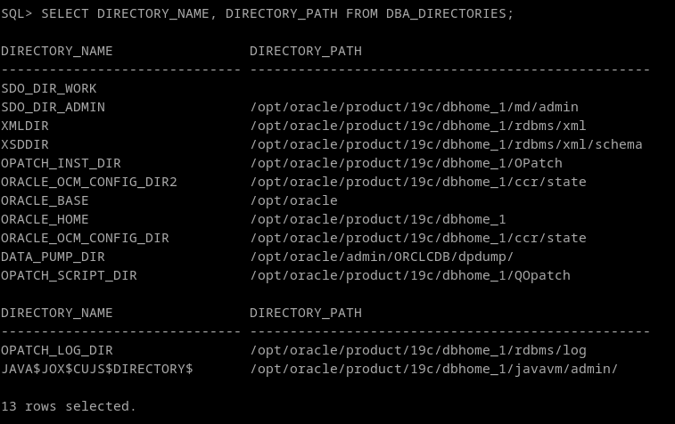
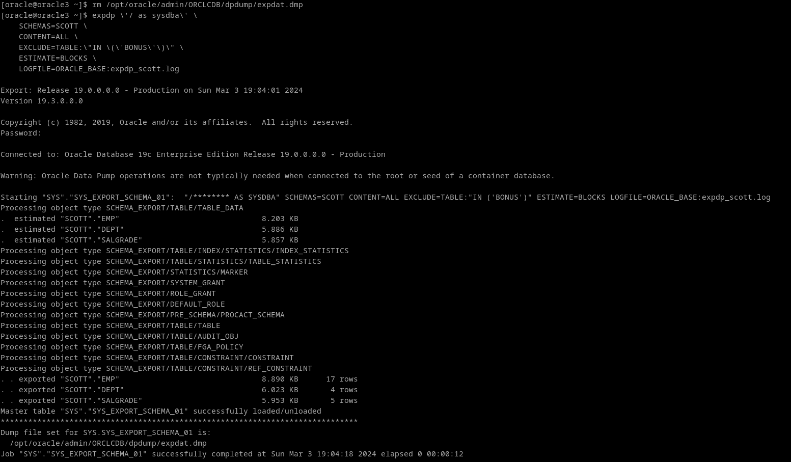

# 1. Realiza una exportación del esquema de SCOTT usando Oracle Data Pump con las siguientes condiciones:

Oracle Data Pump ofrece un traslado masivo de datos y metadatos entre las bases de datos Oracle.

Es una utilidad dedicada que viene con el instant client de oracle. Para llamarla, solo tenemos que ejecutar el comando expdp.

Para realizar las instrucciones pedidas iteraremos sobre el siguiente comando (tambien incluyo la creación de la carpeta del data pump):

```
expdp \'/ as sysdba\' \
    SCHEMAS=SCOTT \
.
.
.
```
Para que oracle reconozca el directorio y no lo mande al directorio por defecto, tenemos que definirlo en la base de datos

```
SELECT DIRECTORY_NAME, DIRECTORY_PATH FROM DBA_DIRECTORIES
```


## • Exporta tanto la estructura de las tablas como los datos de las mismas.

Para ello hay que especificar parámetros, en este caso **CONTENT={ALL | META_DATA_ONLY | DATA_ONLY}.** En nuestro caso queremos todo, así que especificamos ALL.


```
expdp \'/ as sysdba\' \
    SCHEMAS=SCOTT \
    CONTENT=ALL \
.
.
.
```

## • Excluye la tabla BONUS y los departamentos con menos de dos empleados.

**EXCLUDE=tipo_objeto\[:"expresión"\] [, ...]**

```
expdp \'/ as sysdba\' \
    SCHEMAS=SCOTT \
    CONTENT=ALL \
    EXCLUDE=TABLE:\"BONUS\" \
.
.
.
```

## • Realiza una estimación previa del tamaño necesario para el fichero de exportación.

**ESTIMATE=BLOCKS [AND STATISTICS]**

NOTA: Si solo queremos hacer el análisis antes de hacer el data pump, usamos el parámetro ESTIMATE_ONLY. el valor "Y" hará que no se exporte. Una vez se realize el estimado, habra que quitar el parámetro o ponerlo en "N"
**ESTIMATE_ONLY={N | Y}**

```
expdp \'/ as sysdba\' \
    SCHEMAS=SCOTT \
    CONTENT=ALL \
    EXCLUDE=TABLE:\"BONUS\" \
    ESTIMATE=BLOCKS \
.
.
.
```

## • Programa la operación para dentro de 2 minutos.


## • Genera un archivo de log en el directorio raíz.

**LOGFILE=nombre_log**

Podemos ver la definición de directorios en nuestra base de datos con 
```
SELECT DIRECTORY_NAME, DIRECTORY_PATH FROM DBA_DIRECTORIES
```



```
expdp \'/ as sysdba\' \
    SCHEMAS=SCOTT \
    CONTENT=ALL \
    EXCLUDE=TABLE:\"IN \(\'BONUS\'\)\" \
    ESTIMATE=BLOCKS \
    LOGFILE=ORACLE_BASE:expdp_scott.log
```

**Vamos a generar el dpump**


