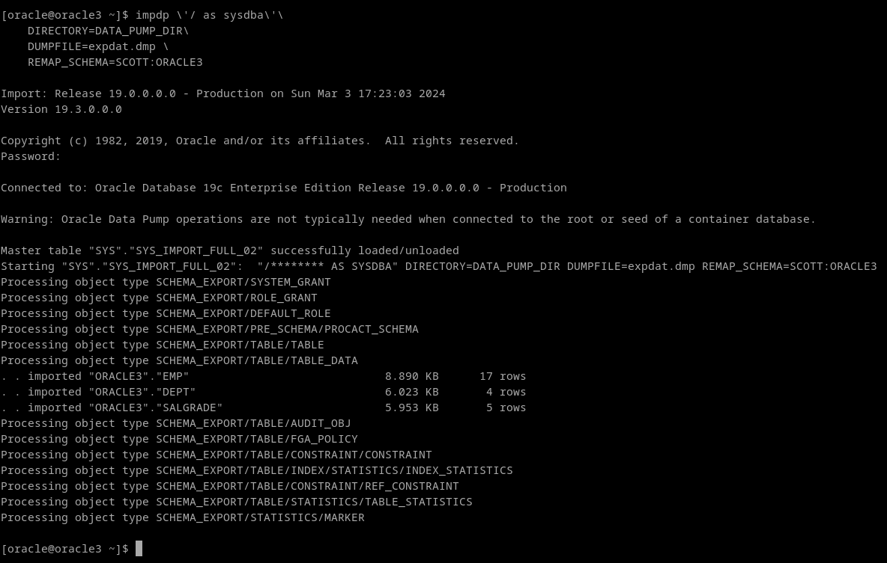
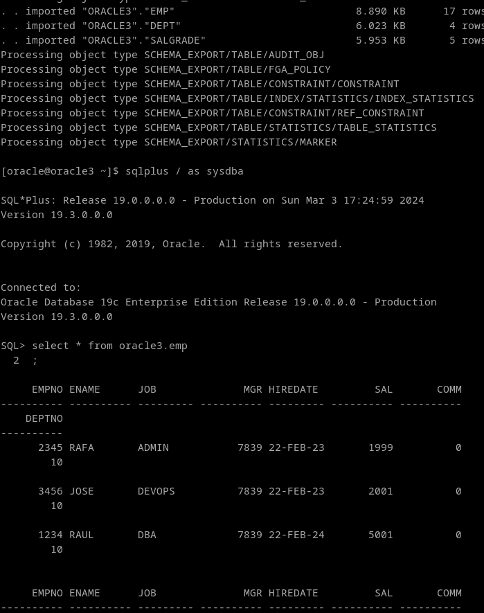

# 2. Importa el fichero obtenido anteriormente usando Oracle Data Pump pero en un usuario distinto de la misma base de datos.

Para importar un data pump, utilizamos el comando impdp

```
impdp \'/ as sysdba\'\
    DIRECTORY=DATA_PUMP_DIR\
    DUMPFILE=expdat.dmp \
    REMAP_SCHEMA=SCOTT:ORACLE3
```



