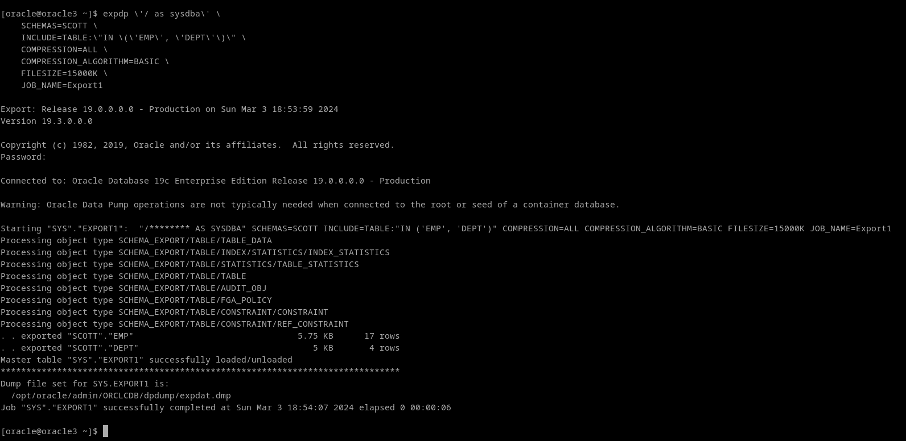

# 3. Realiza una exportación de la estructura de todas las tablas de la base de datos usando el comando expdp de Oracle Data Pump probando al menos cinco de las posibles opciones que ofrece dicho comando y documentándolas adecuadamente.

Podemos llamar a la ayuda con el parámetro "HELP"

expdp HELP=Y

Vamos a ver los siguientes parámetros

| PARAMETRO             | ARGUMENTOS                                   | DESCRIPCIÓN                                                     |
|-----------------------|----------------------------------------------|-----------------------------------------------------------------|
| COMPRESSION 		    | META_DATA_ONLY \| ALL \| NONE \| DATA_ONLY   | Comprime el contenido del archivo de volcado                    |
| COMPRESSION_ALGORITHM | BASIC \| LOW \| MEDIUM \| HIGH               | Indica la fuerza de la compresion                               |
| INCLUDE 	            | OBJECT_TYPE[:NAME_FILTER_EXPRESSION] [, ...] | Al igual que podemos excluir tablas, Podemos incluirlas tambien |
| FILESIZE	            | INTEGER [B \| K \| M \| G]                   | Limita el tamaño maximo del archivo exportado                   |
| JOB_NAME              | JOB_NAME                                     | Nombre de referencia a la tarea de exportacion (NO al archivo)  |

expdp \'/ as sysdba\' \
    SCHEMAS=SCOTT \
    INCLUDE=TABLE:\"IN \(\'EMP\', \'DEPT\'\)\" \
    COMPRESSION=ALL \
    COMPRESSION_ALGORITHM=BASIC \
    FILESIZE=15000K \
    JOB_NAME=Export1

