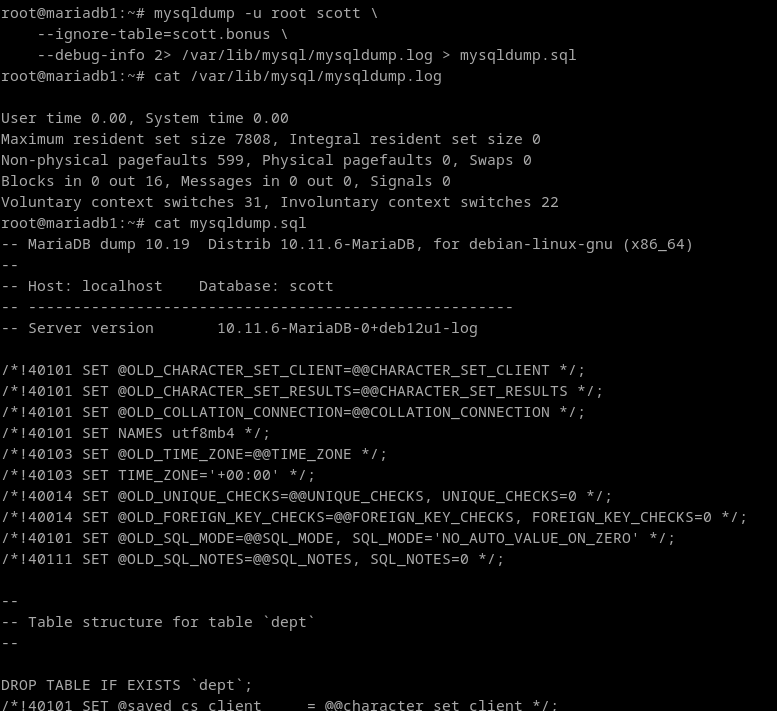

# 4. Intenta realizar operaciones similares de importación y exportación con las herramientas proporcionadas con MySQL desde línea de comandos, documentando el proceso.

Con mysql podemos utilizar el comando mysqldump.

**Exportar**
Voy a intentar hacer el mismo proceso, lo mas cercano posible, que en el ejercicio 1.

```
mysqldump -u root scott \
    --ignore-table=scott.bonus \
    --debug-info 2> /var/lib/mysql/mysqldump.log > mysqldump.sql 
```



**Importar**

Para importar, no hace falta mas que correr el script que se ha generado, y que hemos redireccionado al archivo mysqldump.sql:

```
mysql -u root < mysqldump.sql
```