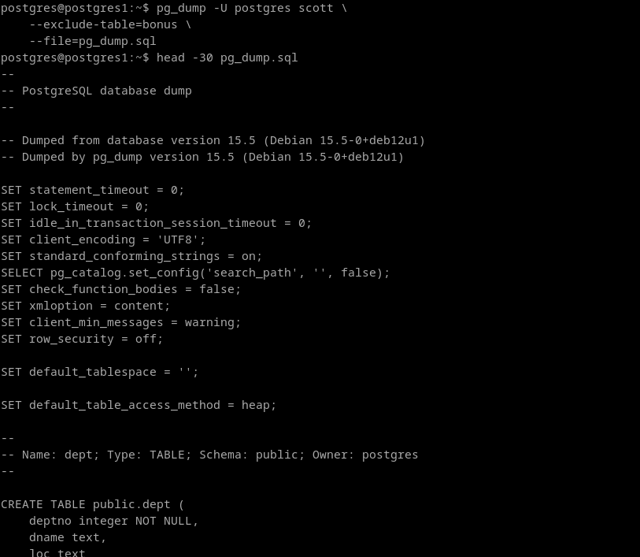
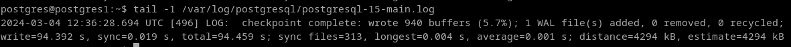

# 5. Intenta realizar operaciones similares de importación y exportación con las herramientas proporcionadas con Postgres desde línea de comandos, documentando el proceso.

Postgresql nos ofrece unas herramienta para este fin llamadas pg_dump y pg_restore.

**Exportar**
Voy a intentar hacer el mismo proceso, lo mas cercano posible al ejercicio 1.

```
pg_dump -U postgres scott \
    --exclude-table=bonus \
    --file=pg_dump.sql
```


No hace falta recopilar logs, ya que se guardan en `/var/log/postgresql`. Tambien sale el tamaño estimado.



**Importar**

