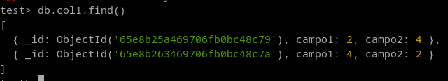
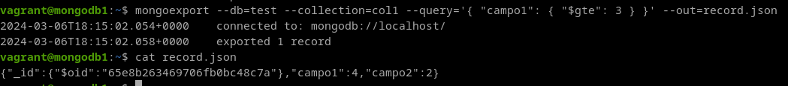
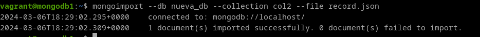

# 6. Exporta los documentos de una colección de MongoDB que cumplan una determinada condición e impórtalos en otra base de datos.


**Exportar**
Utilizamos la herramienta mongoexport:

```
mongoexport --db <nombre_db> --collection <nombre_coleccion> --query <condicion> --out <ruta_archivo>
```

En mi caso, la condición es campo1 sea mayor que 3:



```
mongoexport --db test --collection col1 --query {_id: ObjectId('65e8af761e20de2fd60dc321')} --out mongoexp.json
```



**importar**
Utilizamos la herramienta mongoimport. Importamos a una nueva base de datos:

```
mongoimport --db nueva_db --collection col2 --file record.json
```

