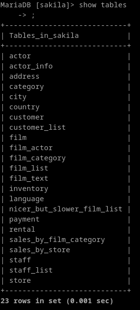
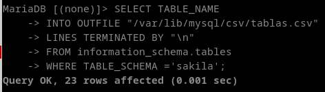
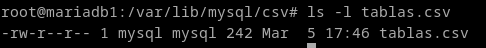
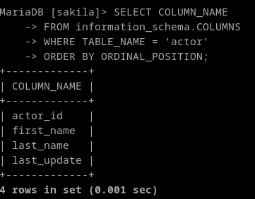
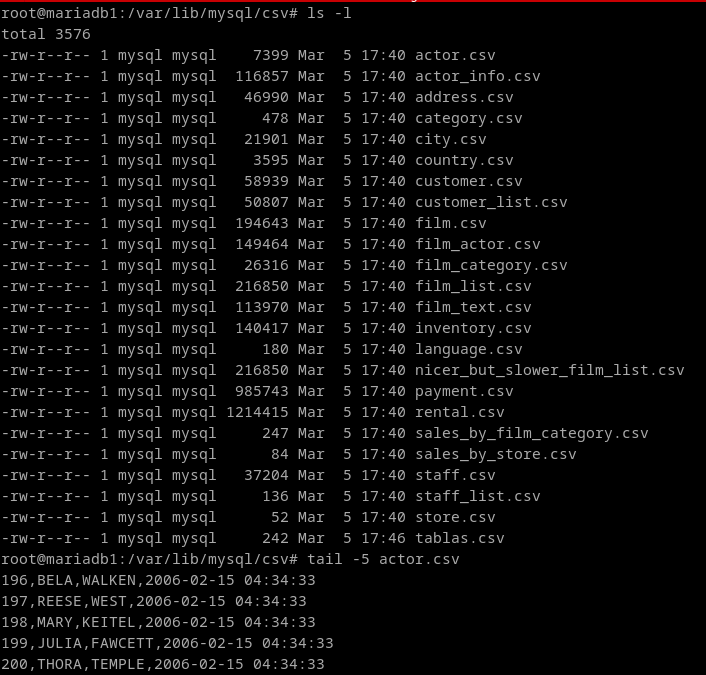
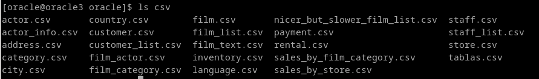
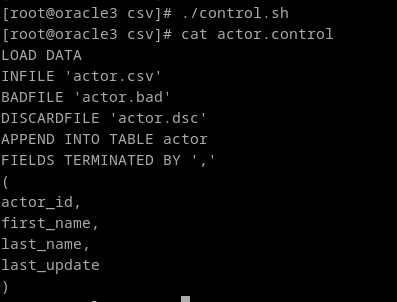

# 7. SQL\*Loader es una herramienta que sirve para cargar grandes volúmenes de datos en una instancia de ORACLE. Exportad los datos de una base de datos completa desde MariaDB a texto plano con delimitadores y emplead SQL\*Loader para realizar el proceso de carga de dichos datos a una instancia ORACLE. Debéis documentar todo el proceso, explicando los distintos ficheros de configuración y de log que tiene SQL\*Loader.


SQL Loader es una utilidad que permite la inserción de datos desde un fichero de texto plano a una base de datos oracle.
Para este ejercicio usaré [esta base de datos](https://downloads.mysql.com/docs/sakila-db.zip)



sql\*loader trabaja con ficheros .csv para hacer las importaciones, así que no podemos exportarla con mysqldump entera y directamente.
Vamos a exportarla entera paso por paso. Primero el esquema de tablas.

Exporto todas las tablas a un txt:

```
mkdir /var/lib/mysql/csv
chown mysql: /var/lib/mysql/csv
```

```
SELECT TABLE_NAME
INTO OUTFILE "/var/lib/mysql/csv/tablas.csv"
LINES TERMINATED BY "\n"
FROM information_schema.tables
WHERE TABLE_SCHEMA ='sakila'
ORDER BY TABLE_NAME;
```




Ahora necesitaremos las columnas, para ver las columnas de una tabla podemos usar la siguiente consulta:

```
SELECT TABLE_NAME, COLUMN_NAME
INTO OUTFILE "/var/lib/mysql/csv/tablacolumnas.csv"
FIELDS TERMINATED BY ','
LINES TERMINATED BY "\n"
FROM information_schema.COLUMNS
WHERE TABLE_NAME IN (SELECT TABLE_NAME
                    FROM information_schema.tables
                    WHERE TABLE_SCHEMA = 'sakila')
ORDER BY TABLE_NAME, ORDINAL_POSITION;

```



Ahora, Para exportar los contenidos de cada tabla de la base de datos podemos crear el siguiente procedimiento:

```
DROP PROCEDURE ExportarCSV;
DELIMITER //
CREATE PROCEDURE ExportarCSV(IN p_schema VARCHAR(255))
BEGIN
    DECLARE v_done BOOL DEFAULT FALSE;
    DECLARE v_tabla VARCHAR(255);
    DECLARE c_tablas CURSOR FOR SELECT TABLE_NAME FROM information_schema.TABLES WHERE TABLE_SCHEMA = p_schema;
    DECLARE CONTINUE HANDLER FOR NOT FOUND SET v_done = TRUE;

    OPEN c_tablas;

    iterar: LOOP
        FETCH c_tablas INTO v_tabla;
        IF v_done THEN
            LEAVE iterar;
        END IF;

        SET @output = CONCAT('/var/lib/mysql/csv/', v_tabla, '.csv');
        SET @query = CONCAT("SELECT * INTO OUTFILE '", @output, "' FIELDS TERMINATED BY ',' LINES TERMINATED BY '\\\n' FROM ", p_schema, ".", v_tabla);
        PREPARE stmt FROM @query;
        EXECUTE stmt;
        DEALLOCATE PREPARE stmt;
    END LOOP;

  CLOSE c_tablas;
END //
DELIMITER ;

CALL ExportarCSV('sakila');
```




**NOTA:** Los tipos de datos BLOB pueden dar problemas, este procedimiento es de uso genérico.

Comprimimos todos estos ficheros para pasarlos entre instancias.



Volvemos a la instancia con oracle, el comando para interactuar con sql\*loader es `sqlldr`. Pero antes, necesitamos un fichero de control, que se ve de la siguiente manera:

```
LOAD DATA
INFILE 'actors.csv'
BADFILE 'actors.bad'
DISCARDFILE 'actors.dsc'
APPEND INTO TABLE actors
FIELDS TERMINATED BY ','
(
actor_id,
first_name,
last_name,
last_update
)
```

**INFILE** especifica el nombre de un fichero de datos que contiene los datos que desean importar.
**BADFILE:** fichero en el que se colocan los registros rechazados.
**DISCARDFILE:** fichero en el que se colocan los registros descartados.

Podemos hacer un script en bash para generar cada uno de estos archivos de control, utilizando el archivo de columnas y el archivo de tablas que hemos recogido antes.
(se que el codigo es terrible, pero no me sale de otra manera)
```
#!/bin/bash
export IFS=$(echo -en "\n\b")
for tabla in $(cat tablas.csv); do
    output="${tabla}.control"

    echo "LOAD DATA" > "$output"
    echo "INFILE '$tabla.csv'" >> "$output"
    echo "BADFILE '$tabla.bad'" >> "$output"
    echo "DISCARDFILE '$tabla.dsc'" >> "$output"
    echo "APPEND INTO TABLE $tabla" >> "$output"
    echo "FIELDS TERMINATED BY ','" >> "$output"
    echo "(" >> "$output"
    
    coma=""
    for tablaycol in $(cat tablacolumnas.csv); do
        echo "$tablaycol" > /tmp/tablaycol
        export IFS=","
	    for i in $(cat /tmp/tablaycol); do
            if [ "$i" = "$tabla" ]; then
                for j in $(cat /tmp/tablaycol); do
                    if [ "$j" != "$tabla" ]; then
			            echo -en "$coma" >> "$output"
                        echo -n "$j" | sed 's/ /_/g' >> "$output"
			            coma=",\n"
                    fi
                done
            fi
        done
	export IFS=$(echo -en "\n\b")
    done
    echo "" >> "$output"
    echo ")" >> "$output"
done
```



Una vez hecho los ficheros de control y los ficheros csv con los datos, lo único que resta es importar la base de datos.

La sintaxis es la siguiente
```
sqlldr <user> CONTROL=<fichero>
```


Así que hagámoslo para todas las tablas:

```
echo tiger > pw.txt

for i in $(ls | grep ".control"); do sqlldr scott CONTROL="$i" < pw.txt ;done

rm pw.txt

```
